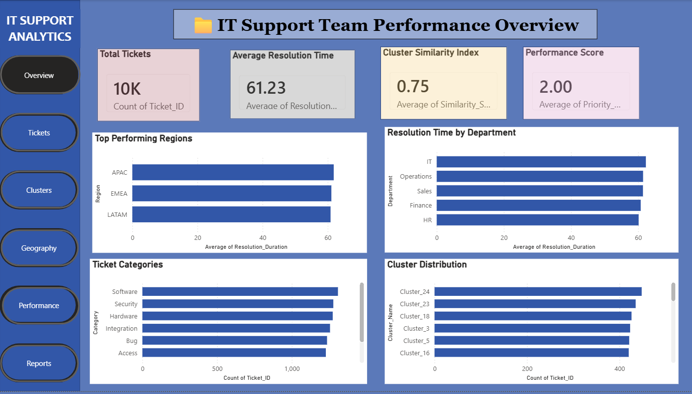
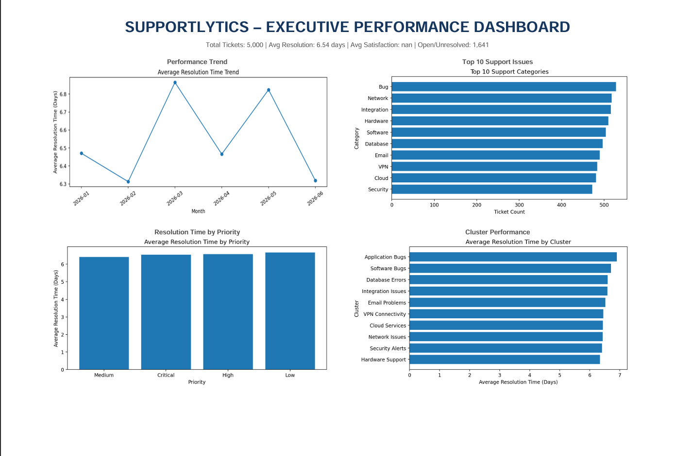
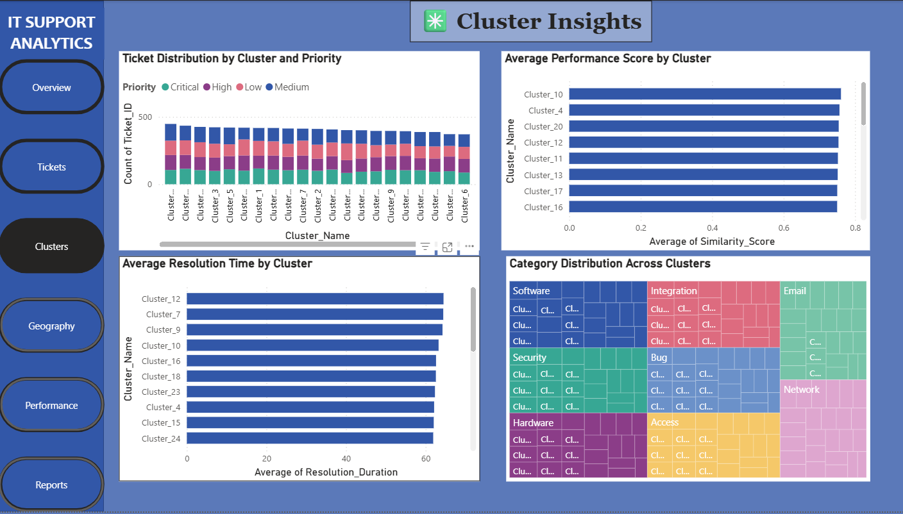
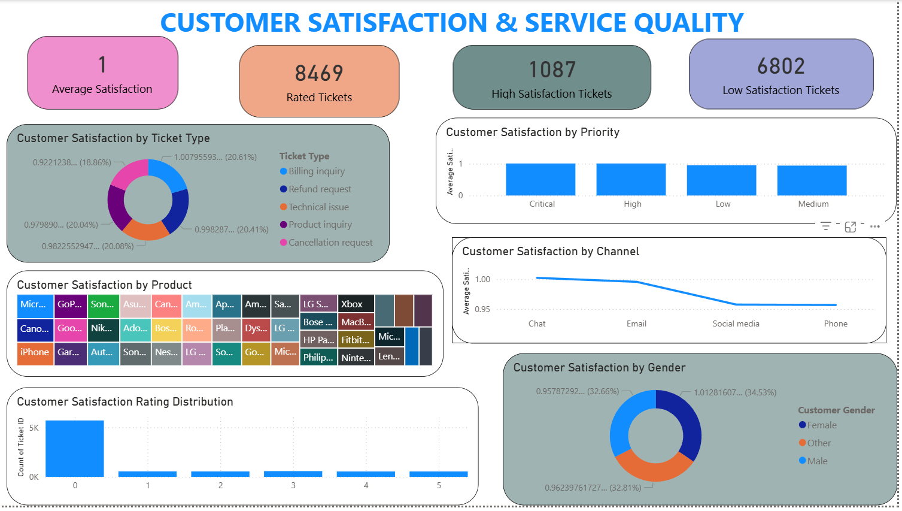
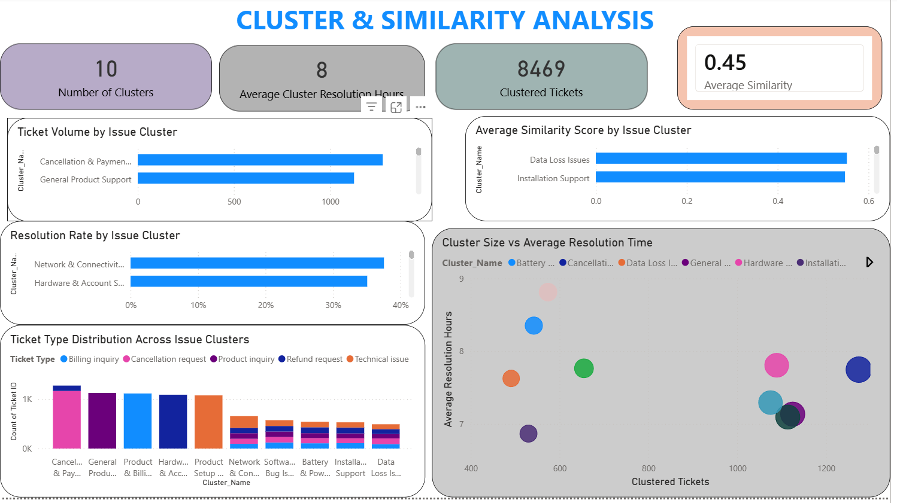
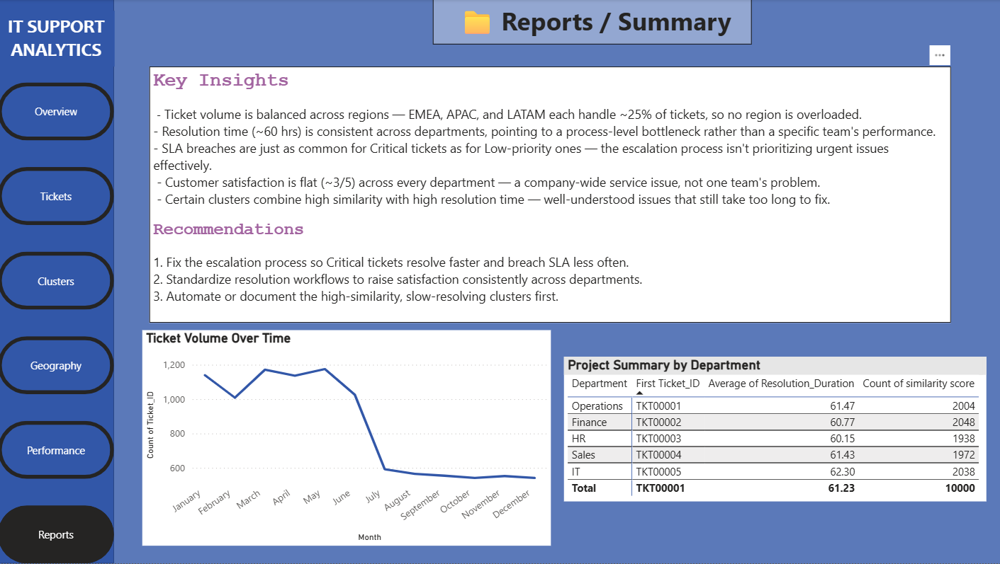

# 📊 Optimizing IT Support Team Performance Using Advanced Analytics (Supportlytics)

## 📌 Project Overview

The primary objective of this project is to analyze IT support ticket data to identify performance trends, improve ticket resolution efficiency, and optimize IT support operations using data analytics and visualization techniques. The project aims to:

- Analyze historical IT support ticket data.
- Measure support team performance using key metrics.
- Identify recurring technical issues and support ticket patterns.
- Discover similar issues using clustering and similarity analysis.
- Improve resource allocation and workflow efficiency.
- Build an interactive Power BI dashboard for decision-making.
- Provide data-driven recommendations to reduce ticket resolution time and improve customer satisfaction.

---

## 🛠️ Tools Used

| Tool | Purpose |
|---|---|
| Python (Pandas) | Data cleaning, feature engineering, and statistical analysis |
| Google Colab | Cloud-based Python execution |
| Power BI | Interactive dashboard visualization |
| Jupyter Notebook | Documentation and analysis |

---

## 📁 Repository Structure
```
Supportlytics/
├── infosys_springboard.ipynb # Full analysis notebook (Colab)
├── IT_Support_Tickets_Cleaned (2).xlsx # Cleaned dataset used by the dashboard
├── Supportlytics_Dashboard.pbix # Power BI dashboard file
├── Supportlytics_Final_Report.docx # Final project documentation
├── Dashboard1.png # Overview page
├── Dashboard2.png # Tickets page
├── Dashboard3.png # Clusters page
├── Dashboard4.png # Geography page
├── Dashboard5.png # Performance page
├── Dashboard6.png # Reports page
└── README.md
```
---

## 🔍 Key Insights from Analysis

### 1. Ticket Volume & Distribution
- Ticket volume is evenly spread across regions — EMEA, APAC, and LATAM each handle ~25% of tickets, so no single region is overloaded.
- Total tickets analyzed: ~10,000

### 2. Resolution Time Metrics
- Average resolution time: ~61 hours, consistent across departments (IT, Sales, Operations, Finance, HR).
- This consistency points to a process-level bottleneck rather than one underperforming team.

### 3. SLA Performance
- SLA breaches occur at similar rates across all priority levels — including Critical tickets, which should breach SLA far less often than Low-priority ones.
- The escalation process needs review to properly prioritize urgent tickets.

### 4. Customer Satisfaction
- Average customer satisfaction: ~3 out of 5, with little variation across departments — indicating a systemic service-quality issue rather than a single team's performance problem.

### 5. Cluster & Similarity Analysis
- Cluster Similarity Index: 0.75
- Some clusters combine high similarity scores with high resolution times — recurring, well-understood issue types that still take too long to resolve, making them strong candidates for automation or a knowledge-base fix.

---

## 📊 Power BI Dashboard Features

The dashboard has 6 interactive pages with cross-filtering and drill-through enabled:

### Overview

KPI summary — total tickets, average resolution time, cluster similarity index, and performance score — plus top-performing regions, department resolution times, ticket categories, and cluster distribution.

### Tickets

Open, resolved, SLA-breached, and high-priority unresolved ticket counts, plus breakdowns by status, product, priority, and channel.

### Clusters

Cluster-level ticket distribution by priority, average performance score, average resolution time, and category distribution across clusters.

### Geography

Global ticket location map plus regional performance score, ticket volume, and resolution time comparisons.

### Performance

Department-level resolution time and performance score, SLA breaches by priority, and customer satisfaction by department.

### Reports

Summarized key insights, recommendations, ticket volume trend over time, and a department-level summary table.

---

## ✅ Recommendations

1. **Fix the escalation process** so Critical-priority tickets resolve faster and breach SLA less often than they currently do.
2. **Standardize resolution workflows** across departments to reduce the current gap in customer satisfaction scores.
3. **Automate or document high-similarity, slow-resolving clusters** first, since they represent well-understood but inefficiently handled issue types.

---

## 👤 Author

- **Podula Sathwika**
- IT Support Analytics Internship — Infosys Springboard
- Mentor: Shanmukha Priya
